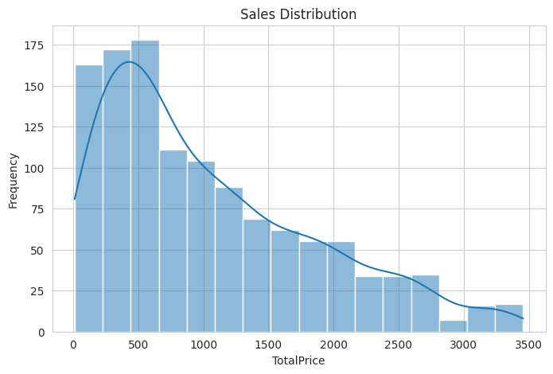
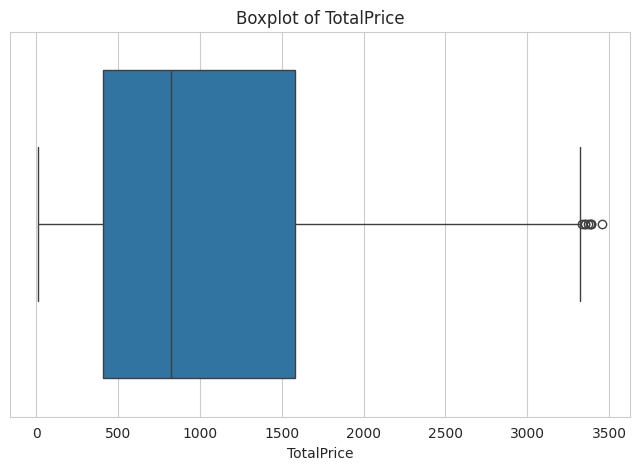
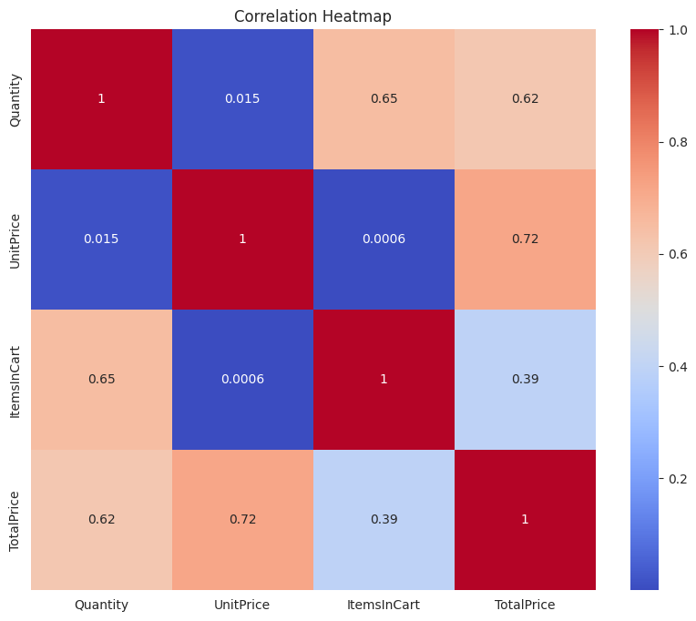

# Project 2 - Exploratory Data Analysis (EDA)

## Project Overview

This project focuses on performing Exploratory Data Analysis (EDA) to identify patterns, distributions, outliers, and relationships within an e-commerce sales dataset.

## Objectives

- Understand data distribution
- Detect outliers using IQR
- Analyze correlations between variables
- Generate business insights from data

## Progress Tracking

| Phase | Status |
|--------|--------|
| Dataset Overview | ✅ |
| Missing Value Analysis | ✅ |
| Descriptive Statistics | ✅ |
| Distribution Analysis | ✅ |
| Mean vs Median Analysis | ✅ |
| Five-Number Summary | ✅ |
| Boxplot Analysis | ✅ |
| Outlier Detection (IQR) | ✅ |
| Correlation Analysis | ✅ |
| Correlation Heatmap | ✅ |
| Key Insights | ✅ |
| Business Interpretation | ✅ |
| Conclusion | ✅ |

## Tools Used

- Python
- Pandas
- NumPy
- Matplotlib
- Seaborn
- Google Colab

## Visualizations

### Distribution Analysis

### Boxplot Analysis

### Correlation Heatmap

## Key Findings

- TotalPrice distribution is positively skewed.
- Eight high-value outliers were detected using the IQR method.
- UnitPrice has the strongest correlation with TotalPrice (0.72).
- Most transactions fall within the low-to-medium price range.

## Files
- Notebook: `P2_Exploratory_Data_Analysis.ipynb`
- Dataset: `cleaned_data.xlsx`
- Visualizations: Histogram, Boxplot, Heatmap
