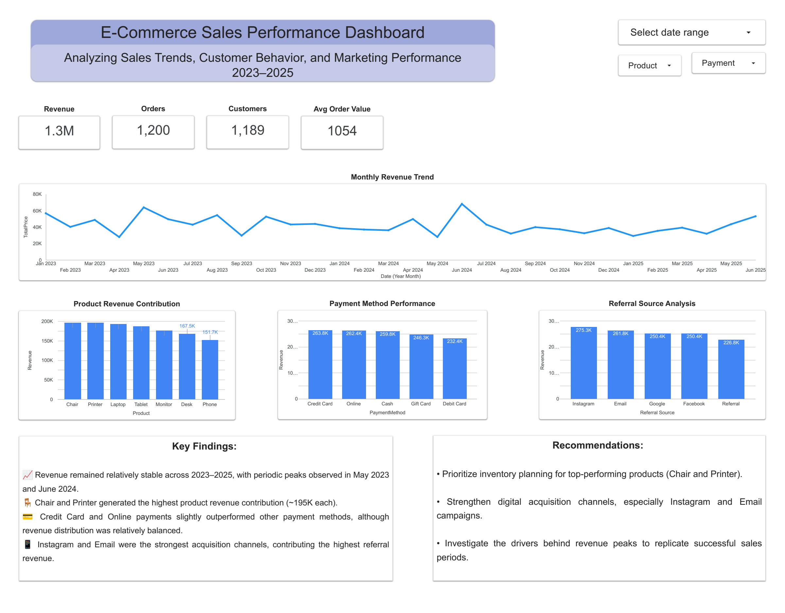

# E-Commerce Sales Performance Dashboard

## Project Overview

This project analyzes e-commerce sales performance from 2023 to 2025 to identify trends, top-performing products, payment preferences, and customer acquisition channels.

## Business Objective

The objective of this dashboard is to:

- Monitor overall sales performance
- Identify top-performing products
- Evaluate payment method effectiveness
- Analyze referral source contributions
- Provide business recommendations based on data insights

## Dashboard Preview



## Key Metrics

- Revenue: 1.3M
- Orders: 1,200
- Customers: 1,189
- Average Order Value: 1,054

## Key Findings

1. Revenue remained relatively stable across 2023–2025, with periodic peaks observed in May 2023 and June 2024.

2. Chair and Printer generated the highest product revenue contribution (~195K each).

3. Credit Card and Online payments slightly outperformed other payment methods, although revenue distribution was relatively balanced.

4. Instagram and Email were the strongest acquisition channels, contributing the highest referral revenue.

## Recommendations

- Prioritize inventory planning for top-performing products (Chair and Printer).
- Strengthen digital acquisition channels, especially Instagram and Email campaigns.
- Investigate the drivers behind revenue peaks to replicate successful sales periods.

## Tools Used

- Google Sheets
- Looker Studio
- GitHub

## Dashboard File

Dashboard PDF is available in:

```text
## Dashboard File

📄 [View Dashboard PDF](dashboard/E-Commerce_Sales_Performance_Dashboard.pdf)
